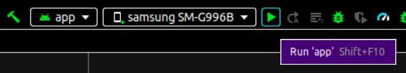

# LiftingStack

Lifting Stack is an Android app that helps you keep track of your weightlifting progress. It is a simple app that allows you to create workoutData programs, add exercises and log your progress. The app is built with Java and XML.

For links to the source code on GitHub, click the following link: [GitHub repository](https://github.com/JakobEdvardsson/LiftingStack)

#### See writen code:

The Java source code for the app can be found in the following folder: "**app/src/main/java/com/example/liftingstack**"

You will now be able to see the java files and packages that make up the app.

### How to run the app:
To run the app, you either need to have Android Studio or have an Android device.

#### Run the app through Android Studio:

If you do not have Android Studio, you can download it [here](https://developer.android.com/studio).

When using Android Studio you can either clone the repository or download the zip file. If you do not have an Android device, you can use the Android Emulator that comes with Android Studio to run the app.

If you have an Android device, you can connect your device to your computer and in Android Studio press the green play button to run the app on your device. As shown below:

You might need to enable USB debugging on your device. To do this, go to Settings -> About phone -> Build number and press it 7 times. Then go back to Settings and you will see Developer options. Press it and enable USB debugging.
Connect your device to your computer and accept the prompt on your device. Then you can run the app in Android Studio.

#### Running the app on an Android Device:

If you have an Android Device and don't want to use Android Studio, or compile the app yourself,
you can download the APK file from the following link: [APK file](https://www.mediafire.com/file/90zob3fzjvlf55s/LiftingStack.apk/file)

The APK file is a file that can be installed on an Android device. To install the APK file, you need to enable the installation of apps from unknown sources.
To do this, go to Settings -> Security -> Unknown sources and enable it. Then you can install the APK file.
When you press the APK file, you will be prompted to install the app. Press install and the app will be installed on your device.
The app will be shown as unsafe, since it is not downloaded from the Google Play Store. Press More info and then press Install anyway.
Your device will then install the app, and you can run it.

##### If you have any questions, feel free to contact us :D
### Created by:
- Jakob Edvardsson
- Benni Hansson
- Alexander Giheden
- Ebba Karlberg
- Oliver Berggren
